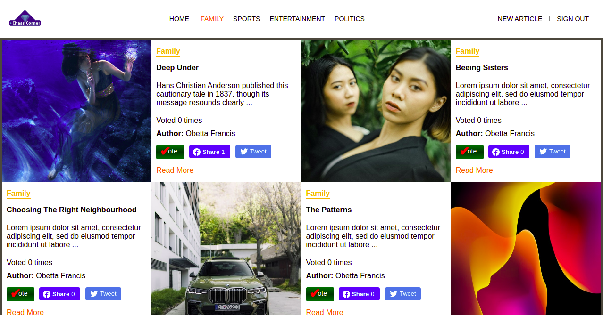

# Chass Corner

> An Exclusive Desktop Blog App. Registered users can contribute articles on a range of topics and can also read and vote for other users' articles.



## Built With

- Ruby On Rails
- ERB
- SCSS
- Javascript
- Postgresql

## Versions
- ruby '2.7.2'
- Rails >= 6.1.3

## Live Demo

[Live Demo Link](https://chass-corner.herokuapp.com/)


## Getting Started

To get a local copy up and running follow these simple example steps.

### Clone the project from it's github repo.

```

  $ git clone https://github.com/chasscepts/chass-corner.git

```

### cd into the project directory

```
  $ cd chass-corner

  # install gems
  $ bundle install

  # install npm dependencies
  $ yarn install

  # create database, run migration and seed the category table
  $ rails db:create
  $ rails db:migrate
  $ rails db:seed

  # start rails server
  # After running command you can visit the page from you browser on http://localhost:3000
  $ rails server

  # Run Tests (RSpec is used for testing)
  $ rspec

  # Run Ruby Linter
  $ rubocop .

  # Run CSS Linter
  $ npx stylelint "**/*.scss"

```

## Authors

👤 **Obetta Francis**

[](https://github.com/chasscepts) [](https://twitter.com/chasscepts) [](https://www.linkedin.com/in/chasscepts/)

## 🤝 Contributing

Contributions, issues, and feature requests are welcome!

Feel free to check the [issues page](https://github.com/chasscepts/chass-corner/issues).

## Show your support

Give a ⭐️ if you like this project!

## Acknowledgments

- This project was inspired by [Nelson Sakwa on Behance](https://https://www.behance.net/gallery/14554909/liFEsTlye-Mobile-version)
- Sample Poster Images taken from [Unsplash](https://unsplash.com/?utm_source=unsplash&utm_medium=referral&utm_content=creditCopyText)
  - [Alice Alinari](https://unsplash.com/@alicealinari?utm_source=unsplash&utm_medium=referral&utm_content=creditCopyText)
  - [Farhan Abas](https://unsplash.com/@farhanabas?utm_source=unsplash&utm_medium=referral&utm_content=creditCopyText)
  - [Chris Ainsworth](https://unsplash.com/@guitarist321?utm_source=unsplash&utm_medium=referral&utm_content=creditCopyText)
  - [Михаил Секацкий](https://unsplash.com/@sekatsky?utm_source=unsplash&utm_medium=referral&utm_content=creditCopyText)
  - [Javier Segura](https://unsplash.com/@javiersegura?utm_source=unsplash&utm_medium=referral&utm_content=creditCopyText)
  - [Martin Katler](https://unsplash.com/@martinkatler?utm_source=unsplash&utm_medium=referral&utm_content=creditCopyText)
  - [Richard Horvath](https://unsplash.com/@orwhat?utm_source=unsplash&utm_medium=referral&utm_content=creditCopyText)
  - [Hans Isaacson](https://unsplash.com/@hans_isaacson?utm_source=unsplash&utm_medium=referral&utm_content=creditCopyText)
  - [Joshua Rawson-Harris](https://unsplash.com/@joshrh19?utm_source=unsplash&utm_medium=referral&utm_content=creditCopyText)
- Huge Thanks to Microserve community for all their supports.
- I appreciate everyone whose work was used in this project.

## 📝 License

This project is [MIT](./LICENSE)
